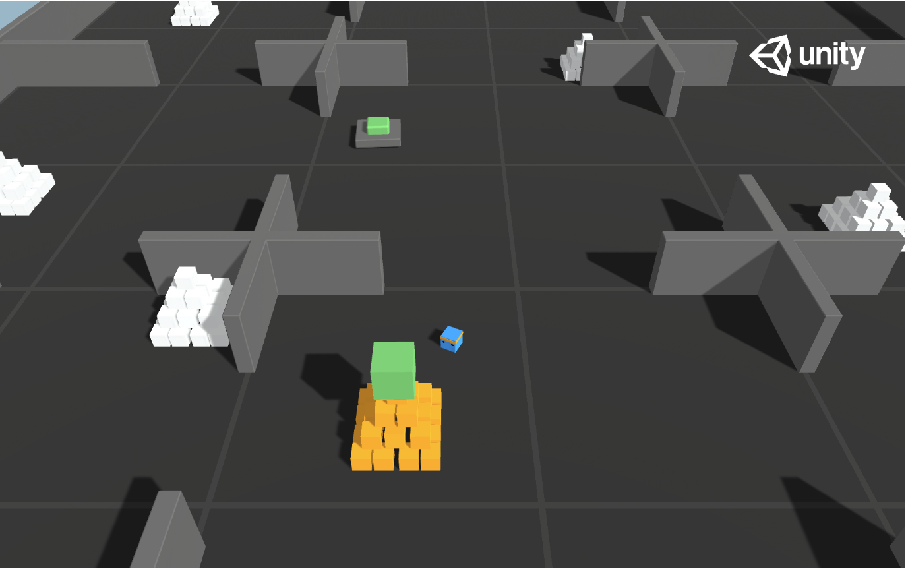

# CS503 VI_Curiosity_Project

This repository contains our implementation of assessing the properties of Pathak et al's definition of curiosity under permutation of state space in two environments:
- the Pyramid game from the Unity environment
- the Mario game from the Gymnasium environment

## **Installation**  
To begin the experiments, you first need to install the required packages and dependencies. To do this, please run the [setup_env.sh](setup_env.sh) script.

```bash
bash setup_env.sh
```
If there is any ModuleNotFound errors, please run
```bash
pip install -e .
```

## **Pyramid environment**
The Pyramid environment consists of a square 2D environment where the blue agent needs to press a button to spawn a pyramid, then navigate to the pyramid, knock it over, and move to the gold brick at the top to get a reward.



### Building the profiles for the environment (optional)
To work in the Pyramid environment, you can **either** take the original environment from Unity:
- download the Unity Game Engine ([Unity Hub]([url](https://unity.com/fr/download)))
- in the Unity Game Engine, download the recommanded editor version 6000.1.1f1
- use the cloned version of [ml-agent github]([url](https://github.com/Unity-Technologies/ml-agents)) that should have been created when running the setup_env.sh
- create a new Project in the Unity Editor (v6000.1.1f1), and open the project
- go to the top menu and select Window -> Package Management -> Package Manager
- in the top left-hand corner of the window that opens, select "+", "Install package from disk", and select your local path to the package of the ml-agents library (should be in ml-agents/Project/Assets/ML-Agents/)
- close the Package Manager window. Now at the bottom of your Project Window the ml-agents files should appear. Select "Assets/ML-Agents/Examples/Pyramids"
- Under Pyramids, select Scenes and double click on the Pyramid scene, which should open the scene
- under File/Build Profiles, at the top left-hand corner of the editor, you can build profiles for your Windows/Mac/Linux/... operating system

**OR**, you can just take our pre-exported profiles. In the Environment folder, we provided our profiles for the small environment, the half environment, and the full environment we used. Note that the linux version has only been tested on the SCITAS cluster, and has been built for linux servers, which may be different from your linux machine.

### Behavior of the agent
Here again, you have two possibilities depending on whether you have installed the Unity Hub application.
#### With Unity editor (optional)
With the training, we also have access to the final weights of the model, which are saved in models/reward_mode/Pyramid.onnx. You can use the onnx_adding_constants.py file with the path to modify the onnx file in order to make it compatible with the Unity Editor. This will generate a Pyramid_modified.onnx file.

Then, in Unity, you can select the agent in the "Hierarchy" tab under "AreaPB", and select the Pyramid_modified.onnx file you just generated. An easy way to do so can be to copy paste the Pyramid_modified.onnx file into the "Pyramids" folder used in Unity (this folder is under ml-agents/Project/Assets/ML-Agents/Examples/Pyramids). You can now click on the "Run" button at the top of the tab to observe the behavior of the agent with your trained policy.

#### With python script
To quickly visualize the environment, you can begin by activating the conda environment
```bash
source ~/miniconda3/etc/profile.d/conda.sh
conda activate curiosity
```

Then, you can crun the following command and change the os to your type of os, and the last parameter to "--small-agents" to visualize in the small environment, or removing it to visualize in the full environment. If you're working on a linux machine, we cannot guarantee that the graphics will work, as we didn't have one to test (we worked in a headless mode on the Scitas cluster).
```python
python Pyramid/GymUnityTrain16.py --os windows --graphics --half_agents --load_model
```

Working on linux may require you to set permissions to the environment folder with
```bash
chmod -R 755 Path/To/your/folder/Pyramid/Environments/
```

### Training the agent
Begin by activating the conda environment
```bash
source ~/miniconda3/etc/profile.d/conda.sh
conda activate curiosity
```

Then, you can run 
```python
python Pyramid/GymUnityTrain16.py --max-episodes 300 --os windows --reward_mode both --update-timestep 1024 --half_agents
```
where the arguments represent:
#### Episode and Update Settings
- `max-episodes` (int, default=100): Maximum number of training episodes to run
- `update-timestep` (int, default=2048): Number of timesteps between policy updates
- `last_epoch` (int, default=0): Starting epoch number for training continuation

#### Environment Configuration
- `os` (str, choices=["linux", "windows"]): Operating system to run the environment on
- `half_agents` (flag): Enable half environment mode with 16 agents
- `small_agents` (flag): Enable small environment mode with 16 agents

#### Reward Configuration
- `reward_mode` (str, choices=["intrinsic", "extrinsic", "both"], default="both"): 
  - `intrinsic`: Use only intrinsic rewards
  - `extrinsic`: Use only extrinsic rewards
  - `both`: Use both intrinsic and extrinsic rewards

#### Visualization and Model Management
- `graphics` (flag): Enable visualization of the agent during training
- `load_model` (flag): Load the last saved model for training continuation

#### State Space and Policy Modifications
- `permute` (flag): Enable state space permutation
- `perturb` (flag): Add Gaussian noise to policy weights

#### Learning Rate Settings
- `scheduler` (flag): Enable learning rate scheduling during training

### Reward curves
The intrinsic and extrinsic rewards are in a tensorboard event file all along the training. Depending on the reward_mode that you chose, the event file will be located in events/reward_mode/. You can then use the Plots.ipynb script to easily visualize them.

## **Mario environment**

### Setup 
In order to run the training on Super Mario Bros, please create the necessary environment from the provided file by running ```conda env create -f full_env.yml``` in your terminal.

### Training the agent
In order to train the agent, please use the ```train.sh``` script provided. It activates the conda environment and launches the training.

The arguments for the training are: 

```--init_model``` (default = None) Path to the actor-critic weights you want to start training from. If you want to train from scratch, please do not use this argument. 

```--init_icm``` (default = None) Path to the ICM weights you want to start training from. If you want to train from scratch, please do not use this argument. 

```--results_path``` Path where you want to save your results

```--curiosity``` (flag) Use intrinsic reward during training

```--extrinsic``` (flag) Use extrinsic reward during training

```--perturb``` (flag) Enable action permutation

```--global_epochs``` (default = 100000): Number of training episodes

```--tr_epochs``` (default = 8): Number of passes on the training dataset

```--batch_size``` (default = 128): Batch size

```--n_step``` (default = 128): Number of steps per episode per worker

```--lr``` (default = 2e-4): Learning rate

### Results

During training, the actor-critic and icm models are saved along with the intrinsic and extrinsic rewards along with the loss and a plot of the extrinsic reward per step. 
They are automatically saved in the results folder. 


